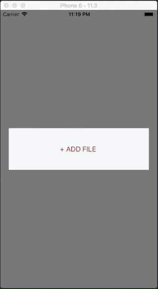

# MediaPresenterFramework
This framework provides an easy way to handle camera, phone library and video pickers. 
It handles permissions and returns a picked data in a delegate.



## Usage
__0. Import module__

__1. Add Privacy Usage Description in your Info.plist for intended pickers you are going to use. - Important!__

__2. Subclass MediaPickerPresenter and conform to protocol:__
```swift
    class ViewController: UIViewController, MediaPickerPresenter {
        
        var attachmentManager: AttachmentManager = AttachmentManager()

        //...

        func didSelectFromMediaPicker(_ file: FileInfo) {
            //do more with file...
        }
```
__3. _(Optional) Customize AttachmentManager:___
```swift
    override func viewDidLoad() {
        super.viewDidLoad()
        
        //For example:
        var titles = attachmentManager.settings.titles
        var settings = attachmentManager.settings
        
	//Customize titles
	titles.actionSheetTitle = "My title"
        titles.cancelTitle = "CANCEL"
        
	//Customize pickers settings
        settings.allowedAttachments = [.photoLibrary, .documents];
        settings.documentTypes = ["public.image", "public.data"];
        
	settings.libraryAllowsEditing = true
        settings.cameraAllowsEditing = true
    }
```
__4. Open menu:__
```swift
    presentAttachmentActionSheet()
```
__5. Check the result in delegate:__
```swift
    func didSelectFromMediaPicker(_ file: FileInfo) {
        print("Picked file: \(file.fileName)")
        //do more with file...
    }
```


Feel free to comment and share your thoughts.


### References
There are sources that were very helpful for creating the framework:
- https://gist.github.com/rpassis/4622291029cd12e4ce2b7585d3e62d15
- https://medium.com/@deepakrajmurugesan/swift-access-ios-camera-photo-library-video-and-file-from-user-device-6a7fd66beca2

### License
The MIT License (MIT)

Piotr Błachewicz 2018
